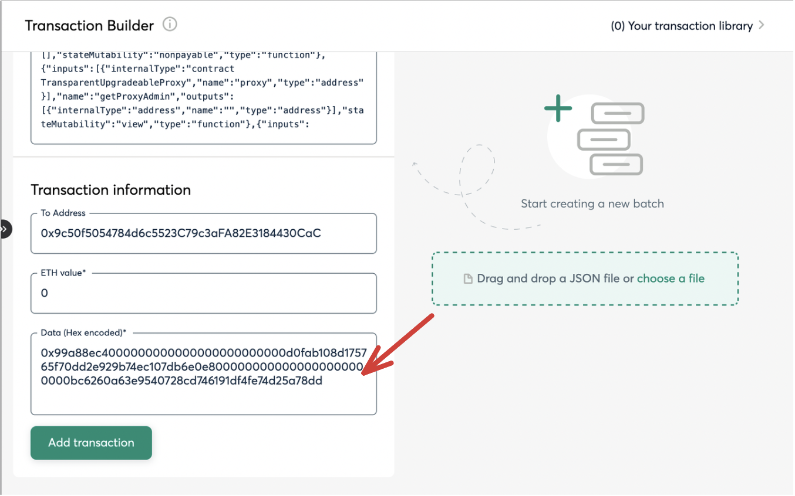
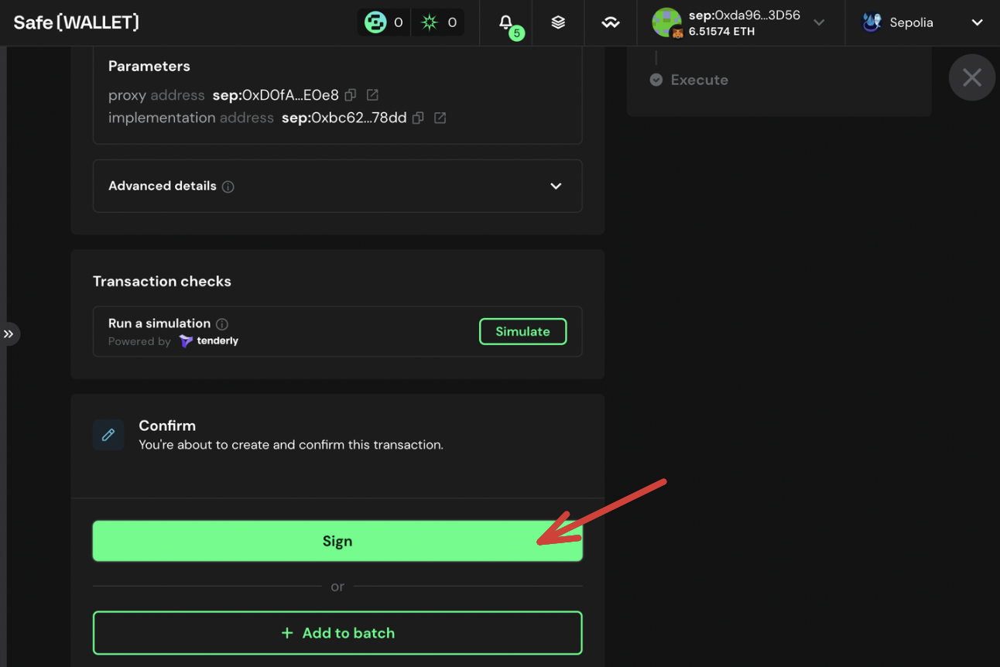
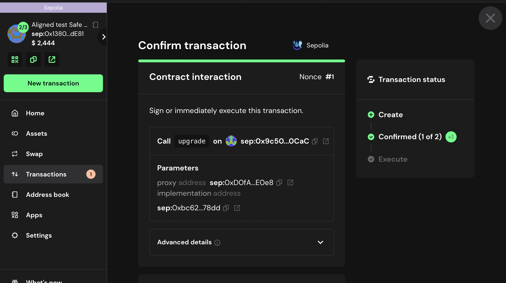

> [!WARNING]  
> Safe Multisig Wallet is not currently supported in Holesky Testnet.
> This guide is ran in Sepolia

# Multisig

In this guide we make an upgrade of Aligned Layer Service Manager contract using a multisig wallet. This is important to ensure not one party can do an upgrade, and helps ensure the team is not locked out of upgrading the network due to a loss of keys.

## Requirements
- Multisig Wallet
  - You can create a Multisig wallet using [Safe](https://safe.global/). For this guide, I have created a 2/3 Multisig.
- [jq](https://jqlang.github.io/jq/download/)

## Initial setup

Once you have a Multisig, you can deploy the contracts using the Multisig wallet address as the upgrader, pauser, etc.

For this, you must set your Safe Multisig's address in the `contracts/script/deploy/config/sepolia/aligned.sepolia.config.json` config file. In case of the `deployer` permission, it is not recommended to set the multisig, as he will deploy many contracts and delegate ownership, it is best to set the address of a wallet with funds, which will be the one that deploys the contracts.

Then, in order to do some action that requires the Multisig Owner, for example upgrading the contract, you must do the following:

## Upgrading the contract

1) Deploy the new implementation by running:

```bash
make upgrade_aligned_contracts
```

And if the new implementation is correctly deployed, the script will show the following message:

```bash
You can propose the upgrade transaction with the multisig using this calldata
<calldata>
```

You should save this `calldata` for later use.

2) Start a transaction request on your multisig, clicking on `New transaction` -> `Interact with contracts`


3) Get the `ProxyAdmin` address, and paste it on `Enter Address or ENS Name`
```bash
jq -r ".addresses.alignedLayerProxyAdmin" contracts/script/output/sepolia/alignedlayer_deployment_output.json | pbcopy
```

4) Get the ABI and paste it on the corresponding box, if not done automatically by the page.
```bash
jq ".abi" contracts/out/ProxyAdmin.sol/ProxyAdmin.json | pbcopy
```


5) Scroll down and Fill the `ETH Value` as 0


6) Paste the calldata saved on step `1` and paste it on the `Data` box



7) Finish creating the transaction


You can previously simulate the tx to make sure everything is OK.



8) Now in your transactions, you should be able to see the newly created Tx


9) If the transaction is correctly created, you have to wait until required Multisig member sign the transaction to send it.

10) You can now approve it with the other signer, as we saw in this case it is a 2/3 multisig




11) The tx should be created, now you should just wait for its approval

